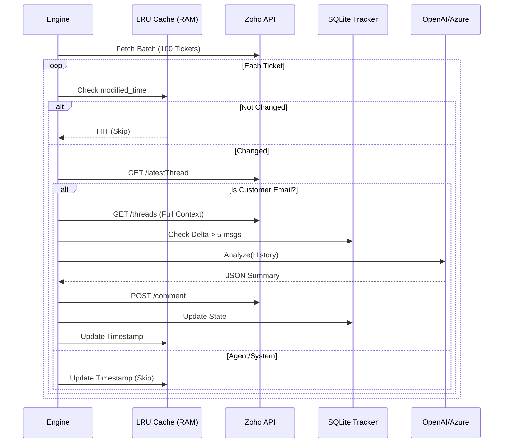

# TicketBot: AI-Powered Helpdesk Automation

TicketBot is a high-performance, stateless-yet-aware automation engine designed to analyze helpdesk tickets (Zoho Desk, HubSpot) using LLMs. It generates incremental summaries, Root Cause Analysis (RCA), and suggested next steps, posting them directly as private comments for support agents.

> **Production Status:** Active
\
> **Architecture:** Smart Polling (Optimized) / Event-Driven (Webhook Ready)

---

## Key Technical Features

* **Smart Polling Engine:**
    * Utilizes a **Thread-Safe LRU Cache** (Limit: 1000) to memoize ticket states in memory.
    * Performs **$O(1)$** complexity checks using `modified_time` timestamps, reducing API calls by 99% for idle tickets.
    * Only fetches thread details when a physical change is detected on the remote platform.
* **Robust Interaction Verification:**
    * Implements a "Fail-Open" verification layer to ensure analysis triggers **only** on incoming emails from customers (`channel: EMAIL`, `direction: IN`).
    * Filters out system notifications, agent replies, and internal state changes to prevent AI hallucination.
* **Resilient State Tracking:**
    * Backed by **SQLite (WAL Mode)** for persistent state tracking across restarts.
    * Uses a "Difference Engine" logic: `(Current_Thread_Count - Last_Processed_Count) >= 5` to determine processing eligibility.
* **Security & Privacy:**
    * Built-in PII Sanitization (Regex-based scrubbing) before sending data to LLM.
    * Uses `post_private_comment` to ensure AI notes remain internal-only.

---

## 🛠 Architecture

### The Optimization Loop (Polling Mode)
Instead of naively fetching threads for every ticket ($O(N)$ API Load), TicketBot uses a tiered caching strategy:

1.  **Level 1 (Memory):** Checks `modified_time` against an internal **LRU Hash Map**.
    * *Match?* → **SKIP** (0 Latency, 0 API Calls).
2.  **Level 2 (Metadata):** Fetches `GET /tickets/{id}/latestThread`.
    * *Is Customer Email?* → **PROCEED**.
    * *Is Agent Reply?* → **UPDATE CACHE & SKIP**.
3.  **Level 3 (Database):** Checks `processed_tickets.db`.
    * *Enough new data?* → **ANALYZE**.

### Sequence Diagram


---

## ⚙️ Installation & Setup

### 1. Prerequisites

* Ruby 3.0+
* SQLite3
* Zoho Desk / HubSpot API Credentials

### 2. Installation

```bash
git clone [https://github.com/your-repo/ticket_bot.git](https://github.com/your-repo/ticket_bot.git)
cd ticket_bot
bundle install

```

### 3. Configuration (`.env`)

Create a `.env` file in the root directory:

```bash
# --- Platform Selection ---
PLATFORM=zoho  # or 'hubspot'

# --- Zoho Desk Credentials (OAuth Self Client) ---
ZOHO_CLIENT_ID=1000.xxxxxxx
ZOHO_CLIENT_SECRET=xxxxxxx
ZOHO_REFRESH_TOKEN=1000.xxxxxxx.xxxxxxx  # Infinite lifespan token
ZOHO_ORG_ID=  # Optional: Auto-detected on startup

# --- LLM Configuration ---
LLM_PROVIDER=openai  # or 'azure'
OPENAI_API_KEY=sk-xxxx
# AZURE_OPENAI_ENDPOINT=... (if using Azure)

# --- Engine Tuning ---
CONCURRENCY_LIMIT=1  # Number of parallel threads
LOG_LEVEL=INFO

```

---

## Usage

### 1. Standard Production Mode (Polling)

Runs the continuous loop. Ideal for background worker processes.

```bash
./bin/start_bot

```

### 2. Single Ticket Mode (Debugging)

Forces the bot to process a specific ticket immediately, bypassing the database "Already Processed" check.

```bash
# Syntax: ./bin/start_bot [TICKET_NUMBER] --force_update
./bin/start_bot 69174 --force_update

```

### 3. Webhook Mode (Event-Driven)

*Note: Requires a public URL (ngrok or deployed server).*
Starts a lightweight WEBrick server to listen for real-time `POST` events from Zoho/HubSpot.

```bash
MODE=webhook PORT=4567 ./bin/start_bot

```

---

## Database Management

The bot maintains a local state in `processed_tickets.db`.

**View Processing History:**

```bash
sqlite3 processed_tickets.db "SELECT * FROM processed_history ORDER BY processed_at DESC LIMIT 10;"

```

**Reset a Ticket (Force Re-processing next cycle):**

```bash
sqlite3 processed_tickets.db "DELETE FROM processed_history WHERE ticket_id = 'YOUR_LONG_ID_HERE';"

```

---

## License

The MIT License (MIT)