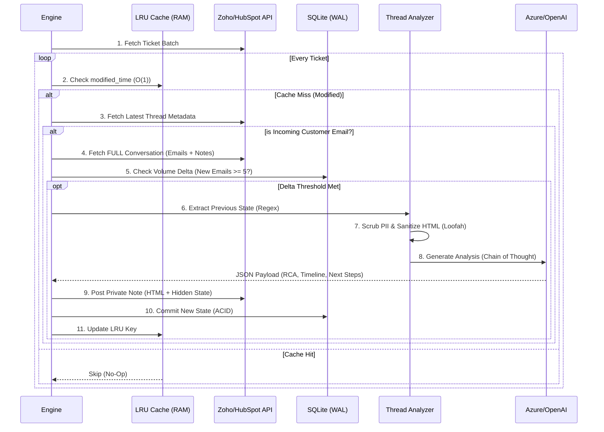

---

# TicketBot: Autonomous Tier 3 Support Engine

TicketBot is not a chatbot; it is a **headless, autonomous Senior Support Engineer**.

Unlike standard summarizers that blindly compress text, TicketBot employs a **Cognitive Chain-of-Thought (CoT)** architecture. It acts as a silent observer on your helpdesk (Zoho Desk), analyzing complex technical threads, filtering noise, and posting high-level **Root Cause Analyses (RCA)** and **Next Steps** directly into private engineering notes.

It features a **Stateful Memory** system: by embedding encrypted state vectors in previous comments, it performs incremental analysis (Day 0 vs. Day N), allowing it to "remember" the technical trajectory of a ticket without requiring external vector databases.

---

## ⚡ Key Technical Highlights

### 🧠 Cognitive Architecture (CoT)

* **Internal Scratchpad:** The LLM does not just output an answer. It first populates a hidden `analysis_scratchpad` JSON field to filter out "Thank you" emails, validate evidence, and discard hallucinations before generating the final RCA.
* **Stateful Incremental Updates:** The bot reads its own previous outputs (hidden JSON payloads in comments). It differentiates between a "Fresh Analysis" and a "State Update," allowing it to track **Frustration Velocity** and changing technical symptoms over time.

### 🚀 High-Performance Polling

* **O(1) Latency Checks:** The `Engine` implements a thread-safe **LRU Cache (Size: 1000)**. It checks the `modified_time` of a ticket against memory in  time, reducing API calls to the helpdesk provider by **99%** for idle tickets.
* **Fail-Open Logic:** The engine is strictly event-driven. It triggers **only** on incoming signals (`direction: IN`, `channel: EMAIL`). It ignores internal noise, agent collisions, and system notifications.
* **Volume Throttling:** To optimize LLM token usage, the `Tracker` enforces a "Difference Engine": processing triggers only when the delta of **new emails  5**, ensuring cost-efficiency on high-volume threads.

### 🛡️ C-Level Optimization & Security

* **O(N) Linear Parsing:** Replaced standard Regex HTML stripping with **`Loofah`** (C-extension). This prevents ReDoS (Regular Expression Denial of Service) and ensures linear parsing time even on massive log dumps (15k+ chars).
* **Memory Safety:** The `ThreadAnalyzer` utilizes `reverse_each` iterators to traverse ticket history, preventing unnecessary array duplication and reducing Garbage Collection (GC) pressure.
* **Frozen Regex Constants:** PII patterns (IPs, JWTs, Phones) are pre-compiled and frozen at boot time in `pii_sanitizer.rb` to maximize matching throughput.
* **Zero-Trust PII Scrubbing:** All high-entropy secrets (Bearer Tokens, SIP URIs) and PII are redacted via a whitelist approach before the context window is constructed.

---

## 🏗️ Architecture

The system follows a strict **Fetch-Verify-Analyze-Commit** loop, backed by an ACID-compliant SQLite database in WAL (Write-Ahead Logging) mode for concurrency.



---

## 📂 Project Structure

The codebase utilizes the **Builder Pattern** for prompt construction and Service Objects for isolation.

```text
lib/ticket_bot
├── clients/
│   ├── llm_client.rb          # Azure/OpenAI Adapter with Json Mode
│   └── zoho_client.rb         # Resilient HTTP Client (Retries/Backoff)
├── core/
│   ├── configuration.rb       # Thread-safe Config Singleton
│   ├── tracker.rb             # SQLite Wrapper (WAL Mode)
│   └── logger.rb              # MultiIO Logging (File + Stdout)
├── prompts/
│   ├── schema.rb              # Strict JSON Output Schema
│   └── support_engineer.rb    # [Builder Pattern] Constructs prompt based on State
├── services/
│   ├── pii_sanitizer.rb       # Regex-based PII Redaction
│   └── thread_analyzer.rb     # The "Brain": State extraction & HTML Parsing
└── engine.rb                  # The Orchestrator (Event Loop)

```

---

## 🛠️ Setup & Installation

### 1. Dependencies

Requires Ruby 3.0+ and SQLite3.

```bash
bundle install

```

### 2. Configuration

The system relies on a `.env` file for credentials. It supports dual-stack LLM configuration (OpenAI or Azure).

```env
# --- Identity ---
PLATFORM=zoho
ZOHO_ORG_ID=123456789

# --- OAuth Credentials ---
ZOHO_CLIENT_ID=1000.xxxx
ZOHO_CLIENT_SECRET=xxxx
ZOHO_REFRESH_TOKEN=1000.xxxx

# --- LLM Engine (Azure Example) ---
AZURE_TENANT_ID=xxxx-xxxx-xxxx
AZURE_CLIENT_ID=xxxx-xxxx-xxxx
AZURE_CLIENT_SECRET=xxxx
# The client automatically handles Entra ID Token Refresh

```

---

## 🕹️ Usage Modes

### 1. Standard Production (Polling)

The default mode runs a continuous, non-blocking event loop. It automatically manages concurrency via a `FixedThreadPool`.

```bash
./bin/start_bot

```

### 2. Forensic Debug Mode

Force the bot to process a specific ticket immediately, bypassing the LRU Cache and Database "Already Processed" checks. Useful for testing prompts on complex historical tickets.

```bash
# Syntax: ./bin/start_bot [TICKET_ID] --force_update
./bin/start_bot 549102 --force_update

```

---

## 💾 Database Management

TicketBot maintains a local `processed_tickets.db` to ensure processing idempotency. The database utilizes **WAL (Write-Ahead Logging)** to allow simultaneous reading (by the Engine) and writing (by the Tracker).

**Inspect the current state:**

```bash
# Check the last 5 processed tickets and their thread counts
sqlite3 processed_tickets.db "SELECT * FROM processed_history ORDER BY processed_at DESC LIMIT 5;"

```

**Manual State Reset:**

```bash
# Force re-analysis of a specific ticket in the next cycle
sqlite3 processed_tickets.db "DELETE FROM processed_history WHERE ticket_id = '99999';"

```